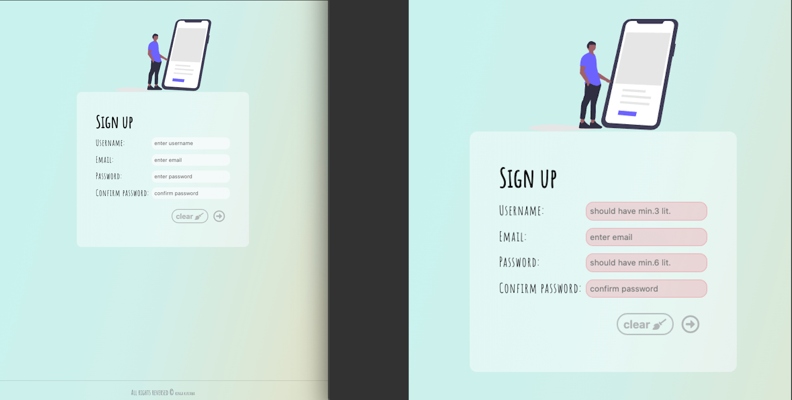

# formValidator
Simple form app which I created for exercise purposes vanilla JS and usage localStorage. 

## Running the app:
https://thirsty-albattani-1be566.netlify.app

## Project is created with:
* HTML
* CSS
* RWD
* Vanilla JS
* localStorage

## Install:
After you clone this repo to your desktop, go to its root directory, click right on index.html and open live server
